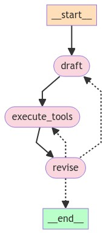

🚀 **LangGraph Reflexion Agent**

An iterative “Draft → Execute Tools → Revise” agent that uses structured reflections and Pydantic schemas to improve answers with targeted web searches.

---

### 🔧 Core Components

- **Prompts & Parsers**  
  - **Actor Prompt** (`actor_prompt_template`):  
    1. Provides initial instruction (either “~250 word answer” or “revise with citations”).  
    2. Critiques its own answer (“be severe”).  
    3. Recommends search queries to improve.  
  - **Parsers**  
    - `JsonOutputToolsParser(return_id=True)` to extract tool-call IDs.  
    - `PydanticToolsParser(tools=[AnswerQuestion])` to validate JSON against our schemas.

- **Schemas** (`schemas.py`)  
  - **AnswerQuestion**:  
    ```py
    answer: str                # ~250 word answer  
    reflection:               # Critique on missing vs superfluous  
      missing: str  
      superfluous: str  
    search_queries: List[str]  # 1–3 queries to research improvements  
    ```  
  - **ReviseAnswer** extends `AnswerQuestion` with:  
    ```py
    references: List[str]      # Citation URLs
    ```

- **Chains** (`chains.py`)  
  - **first_responder**: Uses `AnswerQuestion` tool to draft an answer.  
  - **revisor**: Uses `ReviseAnswer` tool to incorporate new info & citations.  

- **Tool Executor** (`tool_executor.py`)  
  - Wraps `TavilySearchResults` (via `TavilySearchAPIWrapper`) to fetch web results.  
  - Converts parsed search queries into `ToolInvocation` → `ToolMessage`.

---

### 🧩 Workflow Graph



**State Diagram:**

```mermaid
stateDiagram-v2
  [*] --> draft
  draft --> execute_tools
  execute_tools --> revise
  revise --> draft: iteration ≤ 2
  revise --> [*]: iteration > 2
